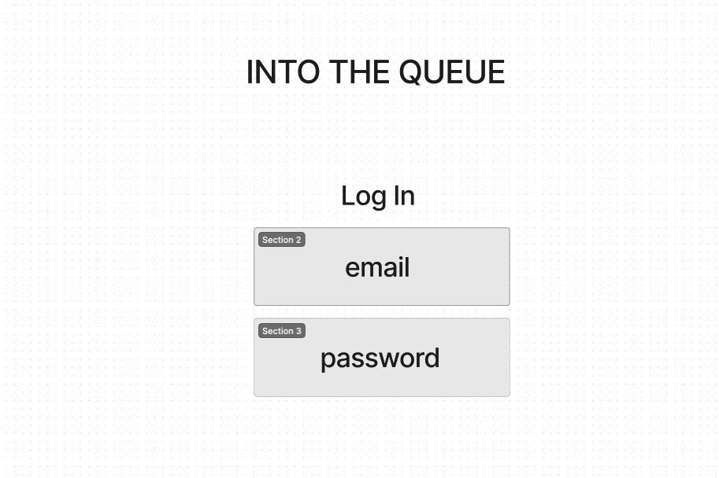
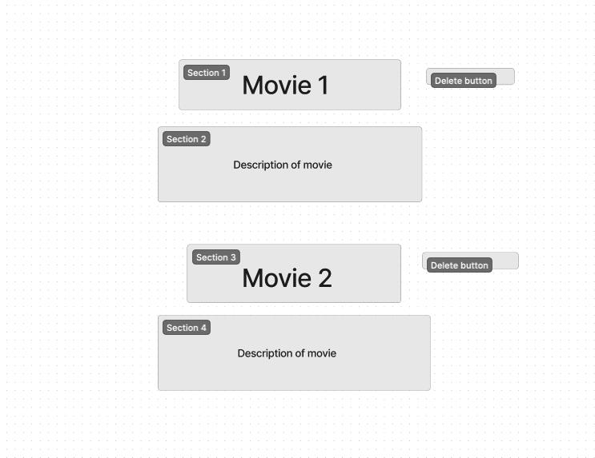
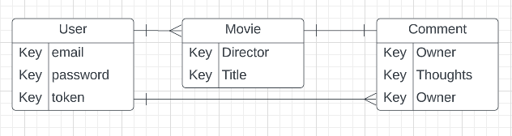

# Into The Queue

## Description
For my full-stack application, I've decided to make a movie tracker. This is essentially a list to keep track of what movies a person hasn't seen and wants to watch in the future. This can also be used to put movies on the list that a person has seen and wants to watch again. Once the user has watched their chosen movie, they'll be able to remove it from the list.

## Technology Used
The following technology was used in order to create this app:
- HTML
- CSS 
- Javascript
- Express
- Mongodb
- Mongoose
- Cors
- Passport 
- Passport_JWT
- Jsonwebtoken
- Bcrypt

## User Stories
### MVP
- As a user, I want to be able to sign up.
- As a user, I want to be able to sign in.
- As a user, I want to be able to add a movie.
- As a user, I want to be able to update how much of the movie I have watched.
- As a user, I want to be able to delete a movie.

### Version 2
- As a user, I want to be able to see the movie poster next to the name.
- As a user, I want to be able to categorize the movies into genres.
- As a user, I want to be able to choose a movie based on the lead actors.

### Version 3
- As a user, I want to be able to search for a movie.
- As a user, I want to be able to write comments for a movie.

## ERD Screenshot

